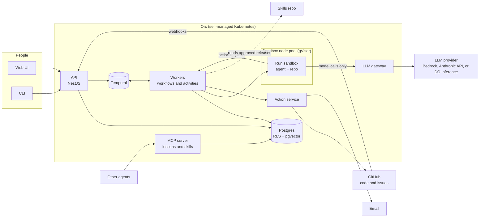
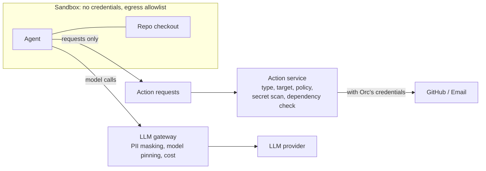
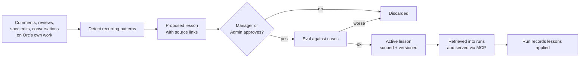

# Orc — Architecture

This document says **how Orc is built**. What Orc must do is in [requirements.md](requirements.md); why each major choice was made is in [decisions/](decisions/README.md). Requirement IDs (FR-, Q-, C-) and decision numbers (0001–0020) are referenced throughout.

## 1. Principles

1. **The core is learning and quality; everything else is replaceable** (0005). Lessons, evals, verification, specifications, and policy are built to last. The coding agent, sandbox, model, and triggers sit behind interfaces.
2. **The agent proposes; Orc acts** (0009). Nothing the AI produces touches the outside world without passing deterministic checks outside the sandbox.
3. **Rigid safety, flexible behaviour.** Workflows stay thin. Limits, permissions, and checks are code; what the agent knows and how it works is skills and lessons.
4. **Isolation in depth.** Organization data is isolated in the database (0014); runs are isolated in sandboxes (0008); credentials never enter a sandbox (0010).
5. **Everything is an API first** (FR-54, C-5). The web UI and CLI are clients of the same OpenAPI spec.

## 2. System overview



## 3. Repository layout

One pnpm monorepo (0015):

```
apps/
  api/        NestJS control plane: REST API, webhooks, policy, lessons, audit, MCP server
  worker/     Temporal workers: workflow definitions and activities
  web/        React (Vite), generated API client, TanStack Query
  cli/        thin client of the API
packages/
  contracts/            integration interfaces and shared types only
  issue-tracker-github/
  code-host-github/
  models-bedrock/
  models-anthropic/
  models-digitalocean/
  notifications-email/
  sandbox-k8s/
  api-client/           generated from the OpenAPI spec
docs/
  requirements.md
  architecture.md
  decisions/
```

The skills live in a **separate repo** (0012).

## 4. Components

### API (`apps/api`)
NestJS, one module per domain: organizations and setup, people and identity, work items, runs, approvals, conversations, policy, lessons, skills, evals, usage and cost, audit, webhooks, MCP.
- Produces the OpenAPI spec with `@nestjs/swagger` (C-5).
- Receives GitHub webhooks, normalizes them into Orc events, maps the actor to a known person (FR-4, FR-5), and decides whether the event is an explicit action (FR-8). Only explicit actions start or signal runs.
- Signs people in through the organization's identity provider over OIDC (FR-58).

### Workers (`apps/worker`)
Temporal workers. **Workflows** (deterministic) hold run state and control flow; **activities** do anything with side effects: sandbox operations, model-driven agent sessions, action execution, external API calls.

### Action service
A module the workers call. The only code in Orc that holds write credentials for GitHub and email (Q-SEC-4). See §7.

### LLM gateway
A small service the sandbox can reach, and the only route to a model. See §7.

### MCP server
Serves approved lessons and skills to other agents (FR-74), with the same access rules as the API (FR-75). Built with the MCP TypeScript SDK, hosted in the API.

### Web UI (`apps/web`)
For seeing, configuring, deciding, and talking with Orc (FR-56). Uses only the generated API client.

### CLI (`apps/cli`)
Starts workflows, answers questions, approves, talks with Orc. Uses only the generated API client.

## 5. Integration contracts

`packages/contracts` defines one interface per kind of integration (Q-ORG-5). Contracts are shaped by what workflows need, not by any vendor's API (0002).

| Contract | v1 implementation | Responsible for |
|---|---|---|
| `IssueTracker` | `issue-tracker-github` | Read work items, comments, attachments; post comments and proposed edits in native format (FR-53); receive events |
| `CodeHost` | `code-host-github` | Clone access, branches, push, pull requests, line and file review comments, stacked pull requests, CI status, events |
| `Notifications` | `notifications-email` | Deliver messages and digests (FR-79, FR-80) |
| `IdentityProvider` | OIDC | Sign-in, user directory |
| `LlmProvider` | `models-bedrock`, `models-anthropic`, `models-digitalocean` | Authenticate, translate, and forward model calls; usage reporting; used only by the gateway (0019) |
| `Sandbox` | `sandbox-k8s` | Create, pause, resume, execute in, copy out of, and destroy execution environments |
| `Agent` | Claude Agent SDK | Run an agent session in a sandbox with given skills, lessons, and allowed action types (0011) |

The API and workers depend only on `contracts`; Nest dependency injection selects the implementation.

## 6. Run lifecycle

A run is one Temporal workflow. Its ID is derived from the work item, so a second run on the same work item can't start while one is in progress (FR-7).

```mermaid
sequenceDiagram
  participant P as Person
  participant API
  participant T as Temporal workflow
  participant SB as Sandbox
  participant AS as Action service
  participant X as GitHub

  P->>API: explicit action (start)
  API->>T: start run
  T->>SB: claim sandbox (warm pool), check out repo
  loop each step
    T->>SB: run agent session (skills + lessons + allowed actions)
    SB-->>T: results + action requests
    T->>AS: action requests
    AS->>AS: check type, target, policy, secrets, dependencies
    AS->>X: perform approved actions
  end
  T-->>P: question or approval needed (via notifications)
  Note over T: paused; sandbox kept (FR-64)
  P->>API: answer / approve / continue
  API->>T: signal
  T->>SB: continue from same state (FR-9)
  T-->>P: finished; record run
```

- **Pausing:** the workflow waits for a signal. The sandbox's storage is kept until the idle limit; after that, resuming rebuilds it from the branch (FR-64).
- **Limits:** attempts, review rounds, and check runs are counters in the workflow (FR-13). Lifetime and resource limits are enforced by the sandbox (FR-65). Spending caps are enforced by the gateway (FR-48).
- **Cancel and pause:** cancellation is Temporal cancellation (FR-10). The emergency stop (FR-83) is a policy flag checked before every activity, plus cancellation of affected runs.
- **Takeover and hand-back:** takeover ends the run and leaves the branch (FR-11). On hand-back, the run starts from the branch's current head, including the person's commits (FR-87). Orc never force-pushes over commits it didn't make.
- **Follow-up:** a confirmed follow-up starts a new run linked to the previous one and seeded with its results (FR-78).
- **Watching proposed changes:** a long-lived workflow per open proposed change reacts to CI results, base-branch movement, and review activity (FR-86, FR-88).

## 7. Security boundary



### Sandbox (0008)
- Agent Sandbox with gVisor (0018), on a dedicated node pool with **no cloud credentials** and the **instance metadata address blocked** by network policy.
- Network policies allow only the gateway, package registries, and other Admin-allowlisted destinations; everything else is blocked and logged (Q-SEC-5).
- The repo is cloned with a short-lived, read-only token minted by Orc for that repo only, which is removed after checkout.

### Declared actions (0009)
Each step of each workflow declares the action types it may request:

| Example step | Allowed action types |
|---|---|
| Spec: draft | propose work item edit, comment on work item |
| Develop: implement | push commits to this run's branch |
| Ship: open | open pull request from this run's branch, add review comments |
| Investigate: diagnose | comment on work item |

The agent's tools write requests; they don't act. The Action service checks each request (type, target, policy, then deterministic checks) and performs it, or rejects it, stops the run, and flags it (Q-SEC-7). For git, Orc copies the commits out of the sandbox, checks them, and pushes them itself.

### LLM gateway (0010)
For every model request: authenticate the sandbox by run, mask PII with Orc's own masking (Q-SEC-3), enforce the approved model version (FR-82) and spending cap (FR-48), forward through the organization's `LlmProvider` (0019), and record tokens, cost, and masked PII types (FR-47).

### Untrusted input (Q-SEC-1)
Work item text, comments, repo content, and conversations are always data in the agent's context, never instructions to Orc's own code. Content that looks like an attempt to steer Orc is flagged (Q-SEC-7), but the boundary above is what stops it.

## 8. Learning system



- **Capture** (FR-67, FR-73, FR-81): comment and review events on Orc's own work items and pull requests, edits to its specifications, and conversations are stored as signals.
- **Detect:** a scheduled workflow groups similar signals and proposes a lesson once a pattern recurs, linking to its sources. Conflicting signals become a conflict for a person (FR-72).
- **Approve** (FR-68): any Manager or Admin.
- **Measure** (FR-70): run the affected skills' eval cases with and without the lesson; reject if worse.
- **Apply:** at the start of each step, retrieve active lessons by scope (organization, team, repo) and by similarity (pgvector) to the work. The run records which ones it used (FR-71).
- **Serve** (FR-74–FR-76): the MCP server answers "which lessons apply to this repo and kind of work," logs what it served, and accepts reports of which lessons an outside agent applied.

## 9. Skills and evals

- **Skills** (0012): a separate repo of SKILL.md folders. A pull request there calls Orc's eval API; a tagged release that passed is registered as approved (FR-39). Workers load a run's skills from the approved release.
- **Cases** (FR-43–FR-45): past work items and the changes that resolved them, plus corrections from people. Cases are frozen at the point in time of the original work, so evals can't see the eventual fix.
- **Evals as workflows:** an eval run is a Temporal workflow that runs cases in sandboxes, scores them, and stores results by skill version, lesson set, and model version.
- **Gates:** a skill release, lesson, or model change that scores worse is blocked (FR-46, FR-70, FR-82).

## 10. Data

Postgres (managed or self-run; any with RLS and pgvector, 0017). Every table has `org_id` with row-level security (0014).

Main entities:

| Entity | Notes |
|---|---|
| Organization, Team, Person, Identity link | Identity links map GitHub accounts and sign-in identities to a person (FR-4) |
| Repo, Repo settings, Product mapping | Build-and-check settings, Admin context, policy (FR-2, FR-3, FR-25, FR-26) |
| Work item reference | Pointer to the tracker's item; Orc doesn't own work items |
| Run, Step, Action request, Action record | Full trace of what happened and why (FR-47, Q-AUD-1) |
| Proposed change | Pull requests per run, stack membership, watch state |
| Conversation, Message | Linked to runs and work items (FR-77–FR-81) |
| Signal, Lesson, Lesson version, Lesson use | Learning system; embeddings in pgvector |
| Skill release, Model version, Eval case, Eval result | Quality system |
| Policy, Approval, Spending cap, Pause flag | Human control |
| Usage record | Tokens, cost, masked-PII types per model call |

- **Backups** (Q-DAT-4): Postgres point-in-time recovery; lessons are versioned, so bulk changes can be undone without a restore.
- **Retention and deletion** (Q-DAT-2): a scheduled workflow deletes per organization policy, including embeddings and stored screenshots.

## 11. Deployment

Self-managed Kubernetes, k3s to start, reference deployment on DigitalOcean Droplets (0017):

| Namespace / group | Runs |
|---|---|
| `orc` | API, workers, web UI, LLM gateway |
| `temporal` | Temporal server (Helm), Postgres for persistence |
| `orc-sandboxes` on a dedicated node pool | Agent Sandbox controller, warm pools, run sandboxes (gVisor) |

- **Images:** per-repo sandbox images with dependencies pre-installed, rebuilt on a schedule, so a sandbox starts close to ready (Q-PERF-1).
- **Environments:** a non-production copy uses its own GitHub App and a repo or label filter so it never acts on production work (Q-OPS-1).
- **Deploys:** rolling, with Temporal keeping runs alive across worker restarts (Q-REL-1, Q-REL-2).

## 12. Observability and audit

- **Tracing:** OpenTelemetry across API, workers, gateway, and Action service, with the run ID on every span (Q-OPS-2).
- **Audit:** every action record, approval, policy change, pause, and restore is written to an append-only audit table (Q-AUD-1, Q-AUD-3).
- **Usage:** the gateway's usage records feed the cost views (FR-50).

## 13. To verify early

These assumptions carry the most risk. Each should be tested before building on it:

1. **Agent SDK through the gateway** (0011): the Claude Agent SDK can send model calls to Orc's gateway (Anthropic-compatible API) instead of directly to a provider.
2. **Agent Sandbox** (0018): pause and resume keep state; warm-pool start time; gVisor runs on the reference node image and runs the repos' build and test tools.
3. **PII masking** (0019): Orc's own masking quality and latency on realistic work item and log content.
4. **Copying commits out** (0009): reliably extracting and verifying commits from the sandbox, including for submodule repos (FR-31).
5. **DigitalOcean provider** (0019): translation from the gateway's Anthropic-compatible API to DO's OpenAI-compatible endpoints preserves tool use, caching, and thinking.
6. **Reference Postgres** (0017): RLS and pgvector on the chosen managed Postgres.
